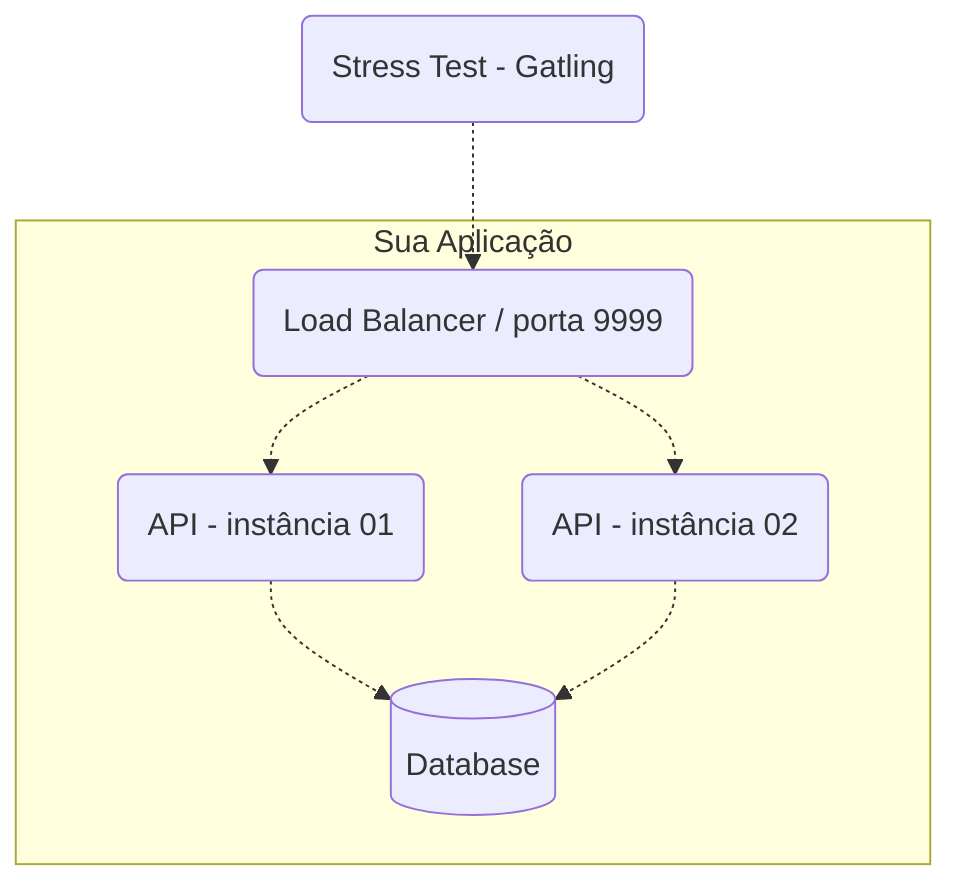

# Rinha de Backend - Edição 2024 Q1

- Banco de dados: Postgres, MySQL ou MongoDB
- O ambiente será limitado com 1.5 CPU e 550MB distribuídos entre todos os recursos (banco de dados, APIs, LB).

Projetos:

- **api-transacoes-jvm:** API com Spring Boot rodando em JVM.
- **api-transacoes-native:** API com Spring Boot rodando em modo native.

## Arquitetura



## API

Endpoints:

- `POST /clientes/[:id]/transacoes`: para efetuar uma transação de crédito ou débito.
- `GET /clientes/[:id]/extrato`: para consultar o extrato do cliente.

**Transação**

Uma transação de débito não pode deixar o saldo do cliente mais negativo do que o limite disponível.
Um cliente com limite de 10000 (R$ 100,00) pode ficar com saldo negativo de até -10000 (- R$ 100,00).

Payload para realizar uma transação:

- `tipo`: tipo da transação, `c` para crédito e `d` para débito;
- `valor`: inteiro com o valor da transação em centavos;
- `descricao`: string de até 10 caracteres com a descrição da transação.

O ID da pessoa precisa ser um número inteiro.

Retornos:

- Status 200: cliente existe e transação realizada, retornar o limite e o saldo atualizado.
- Status 404: cliente não encontrado pelo ID.

** Consulta de Extrato**

Retornos:

- Status 200: cliente existe, retornar o saldo e as últimas 10 transações.
- Status 404: cliente não encontrado pelo ID.

## Build

```bash
mvn -Pnative spring-boot:build-image
```

## Links

- [Rinha de Backend - 2024 Q1](https://github.com/zanfranceschi/rinha-de-backend-2024-q1)
- Postgres:
    - [Configuring work_mem in Postgres](https://www.pgmustard.com/blog/work-mem)
    - [Using BUFFERS for query optimization](https://www.pgmustard.com/blog/using-postgres-buffers-for-query-optimization)

